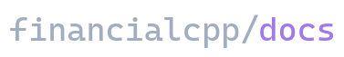

[financialcpp.com]([financialcpp.com)

This is the documentation website for **financialcpp**, a c++ stock trading framework with high quality javascript bindings

## Main Goals
Write clean, simple, documentation with loads of examples. Make no assumptions about the audience (beginner-friendly) while still making it easy for advanced users to find information.

## Contributing to the docs
Contributions to the docs are welcome! Send a pull request and we'd be happy to merge them in ☺️

## Dev environment
Uses nuxt internally to generate the documentation site. All tutorials and api pages are manually written here. They are not generated from comment blocks in the source code.

Install dependencies:

```bash
npm run install
```

## Development

```bash
npm run dev
```

## Static Generation

This will create the `dist/` directory for publishing to static hosting:

```bash
npm run generate
```

To preview the static generated app, run `npm run start`

For detailed explanation on how things work, checkout [nuxt/content](https://content.nuxtjs.org) and [@nuxt/content theme docs](https://content.nuxtjs.org/themes-docs).
